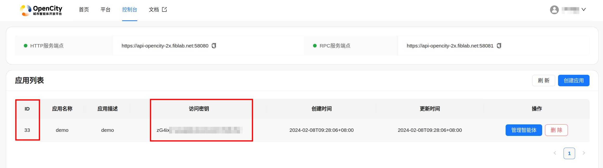

# Mobility_Class
- 这是一个为移动数据挖掘课程构建的移动智能体工具仓库——欢迎各位同学使用
- 基于[Pycityagent](https://github.com/tsinghua-fib-lab/pycityagent)构建，欢迎各位同学关注原仓库，构建具有个人特色的城市智能体

# 配置说明
## 账号申请
- 你需要在OpenCity平台申请个人账号 [Opencity website](https://opencity.fiblab.net/)
- 登陆并进入个人终端
- 创建App并获取secret
    - 

## 配置构建
- 主要包含三项配置内容: **llm_request**, **citysim_request** and **apphub_request**
```yaml
llm_request:
  text_request:
    request_type: qwen
    api_key: xxx
    model: qwen-turbo
  img_understand_request: (随意填写)
    request_type: qwen
    api_key: xxx
    model: xxx
  img_generate_request:  (随意填写)
    request_type: qwen
    api_key: xxx
    model: xxx

citysim_request:
  simulator: 
    server: https://api-opencity-2x.fiblab.net:58081
  map_request:
    mongo_coll: map_beijing_extend_20240205
    cache_dir: ./cache
  route_request: 
    server: http://api-opencity-2x.fiblab.net:58082
  streetview_request: (随意填写)
    engine: baidumap
    mapAK: xxx

apphub_request: (如无需使用前端支持，可删除整个apphub_reqeust配置节或随意填写)
  hub_url: https://api-opencity-2x.fiblab.net:58080
  app_id: 上一步中申请的APP_ID
  app_secret: 上一步中获取的APP_SECRET
  profile_image: icon.png(用于在配置前端头像)
```
- 注意：上述配置为非完整配置清单——如想了解完整配置请参考Pycityagent仓库

### LLM_REQUEST
- 移动智能体以LLM为基础：
- **text_request**
  - 目前，我们支持 [**qwen**](https://tongyi.aliyun.com/) 以及 [**openai**](https://openai.com/)
      - `注意：测试阶段主要基于qwen进行，使用openai可能会出现错误，欢迎在原仓库以及当前仓库提出issue`
  - 获取你的**api_key**，并选择**model**
    - 对于千问模型，请访问 [Qwen](https://dashscope.console.aliyun.com/dashboard)
        - 新用户可获得1000,000 token免费额度，课程期间的合理使用不会产生额外花费
        - `注意：不同模型的价格不同，例如上述的qwen-turbo，超出免费额度部分价格为0.008元/1000tokens`
        - `具体价格以官方平台为准`
  - 移动智能体只需要使用`text_request`，其他两项随意填写即可
- **citysim_request**
    - 与模拟器关联的配置选项
    - 不用调整
    - 其中`map_request.cache_dir`用于缓存地图数据，可自己更改（需要先创建对应文件夹）
    - 移动智能体无需使用`streetview_request`，随意填写即可
- **apphub_request**
    - 与前后端关联的配置选项
    - 将你获取到的**app_id** 以及 **app_secret** 置于此处.
        - [Opencity website](https://opencity.fiblab.net/)

# 本仓库使用方法
## Clone
- 克隆仓库至本地
- 安装关联包
  ``` shell
  pip install -r requirements.txt
  ```
- `推荐在jupyter-notebook（或其他交互式编程环境中）使用，方便同学们调试输出`

## 具体编码方案
- 第一步：导入库
```python
from mobility import MobilityAgent
```
- 第二步：创建移动生成智能体
    - arg_1: config_path: 配置文件路径（相关路径即可）
    - arg_2: agent_id: 你的agent_id，注意，该id是唯一的，如出现重复会报错
    - arg_3: agent's name: agent的名称
    - `注意：首次执行时耗时会较长，因为需要从远端拉取数据至本地——map_request.cache_dir`
```python
agent = MobilityAgent("your_config_path", agent_id, "your agent's name")
```
- 第三步：查看当前的promts
    - 该接口会输出所有的可配置prompt
    - 每条prompt包含三个条目：
        - f_string: 格式化字符串，其中`{}`为格式化参数接口
        - variables: 格式化数据内容，与`{}`一一对应
        - function: 描述该prompt的功能
```python
agent.print_prompts()
"""
示例输出：
Time generation prompt:
f_string: How long will you spend on this arrangement?
You must consider some fragmented time, such as 3 hours plus 47 minute, and 7 hours and 13 minutes.
Please answer as a list: [x,y]. Which means x hours and y minutes.,
variables: [],
function: 用于生成intention对应的时间
"""
```
- 第四步：prompt配置
    - arg_1: 配置目标，可选项为包括`['system', 'person', 'day-weekend', 'day-workday', 'intent-first', 'intent-last', 'intent-normal', 'time']`
        - system: LLM system role配置
        - person: 人物描述配置
        - day-weekend: 周日描述配置
        - day-workday: 工作日描述配置
        - intent-first: 一天中首次intent生成描述配置
        - intent-last: 一天中最后一次intent生成描述配置
        - intent-nornal: 常规intent生成描述配置
        - time: 时间生成描述配置——指各个intent花费多少时间
    - arg_2: prompt: 格式化字符串（也可以是常规字符串，如果不需要添加任何动态参量）
    - arg_3: 格式化参量表，默认为空，可选项包括`['genderDescription', 'educationDescription', 'consumptionDescription', 'occupationDescription', 'day', 'dayDescription', 'personDescription', 'intentTotal', 'intentIndex', 'history']`
        - genderDescription: 人物性别信息
        - educationDescription：人物受教育水平信息
        - consumptionDescription：人物消费水平信息
        - occupationDescription：职业相关信息
        - day：日期信息
        - dayDescription：日期描述信息（生成的，基于target:day-xx）
        - personDescription：人物描述信息（生成的，基于target:person）
        - intentTotal：总intent数量
        - intentIndex：当前的目标intent（运行时信息）
        - history：历史行程信息（运行时信息）
```python
agent.set_prompt(target='day-workday', prompt="{}, normally in workdays, people need to work.", vars=['day'])
```
- 第五步：执行
    - arg_1: intent数量，与intentTotal直接关联
    - arg_2: 日期信息，与day直接关联
    - arg_3: show_prompts: 布尔类型，默认为False，是否在执行过程中输出与LLM的交互信息
    - arg_4: hub: 布尔类型，默认为False，是否需要前端显示
        - `注意：如果为False, 则配置文件中的app关联信息可以不申请，agent_id可随意设置，agent_name可随意设置`
        - `注意：由于平台目前仍处于开发中，经常会进行维护和升级，如出现报错，请使用False`
```python
await agent.run(4, 'Monday')
"""
示例输出：
[['go to sleep', '(00:00, 07:55)', ('碣石坪小区-西门(人行门)', 700161349)], ['go to work', '(08:11, 16:51)', ('中共中铝国际工程股份有限公司委员会', 700450261)], ['eat', '(17:40, 19:17)', ('亦庄地下美食广场', 701117234)], ['go to sleep', '(20:00, 23:59)', ('碣石坪小区-西门(人行门)', 700161349)]]
"""
```